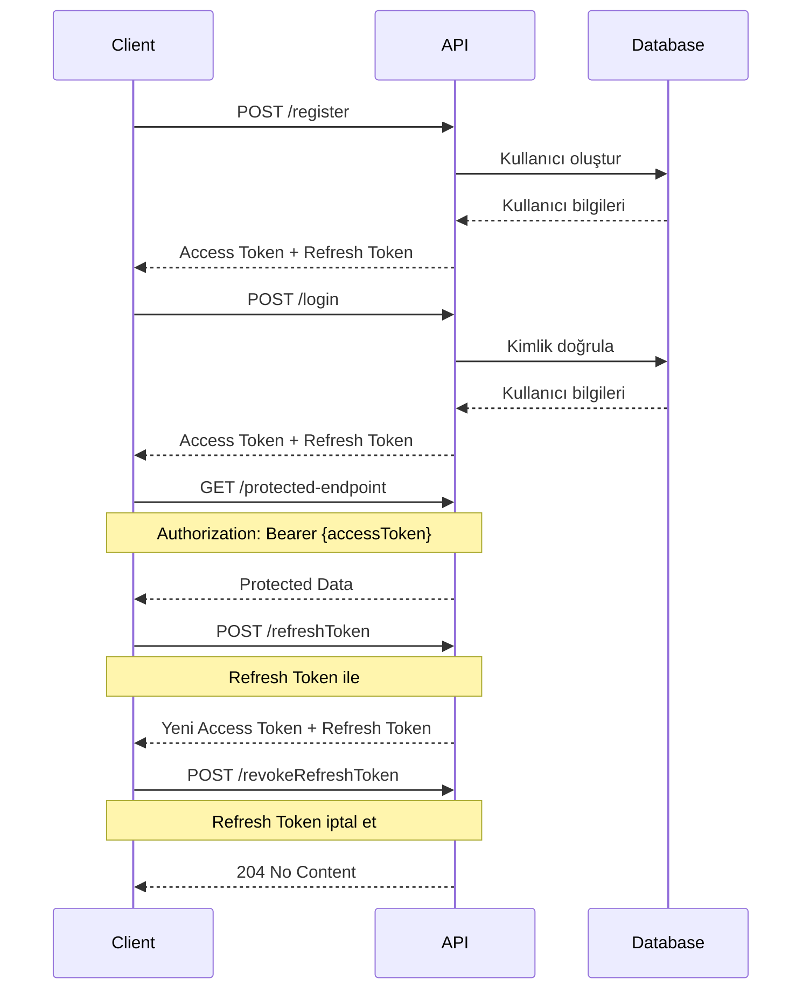

# TE4IT Authentication API Dokümantasyonu

**Sürüm:** 1.0  
**Tarih:** Ocak 2025  
**Base URL:** `https://localhost:5001/api/v1/auth`

---

## 📋 İçindekiler

1. [Genel Bilgiler](#genel-bilgiler)
2. [Authentication Flow](#authentication-flow)
3. [API Endpoints](#api-endpoints)
4. [Request/Response Modelleri](#requestresponse-modelleri)
5. [Hata Kodları](#hata-kodları)
6. [Kullanım Örnekleri](#kullanım-örnekleri)
7. [Güvenlik Notları](#güvenlik-notları)

---

## 🔐 Genel Bilgiler

### Authentication Sistemi
TE4IT API'si **JWT (JSON Web Token)** tabanlı kimlik doğrulama sistemi kullanır. Sistem şu bileşenlerden oluşur:

- **Access Token**: API endpoint'lerine erişim için kullanılır (kısa süreli)
- **Refresh Token**: Access token'ı yenilemek için kullanılır (uzun süreli)
- **Token Rotation**: Güvenlik için refresh token'lar otomatik olarak yenilenir

### Rate Limiting
- **Refresh Token**: Saatte 5 istek sınırı
- **Login**: Saatte 10 istek sınırı
- **Register**: Saatte 5 istek sınırı

---

## 🔄 Authentication Flow



---

## 🚀 API Endpoints

### 1. Kullanıcı Kaydı

**Endpoint:** `POST /api/v1/auth/register`

**Açıklama:** Yeni kullanıcı hesabı oluşturur ve otomatik olarak giriş yapar.

**Request Body:**
```json
{
  "userName": "string",
  "email": "string",
  "password": "string"
}
```

**Response (201 Created):**
```json
{
  "userId": "123e4567-e89b-12d3-a456-426614174000",
  "userName": "johndoe",
  "email": "john.doe@example.com",
  "accessToken": "eyJhbGciOiJSUzI1NiIsInR5cCI6IkpXVCJ9...",
  "expiresAt": "2025-01-13T15:30:00Z",
  "refreshToken": "refresh_token_here",
  "refreshExpires": "2025-01-20T15:30:00Z"
}
```

**cURL Örneği:**
```bash
curl -X POST "https://localhost:5001/api/v1/auth/register" \
  -H "Content-Type: application/json" \
  -d '{
    "userName": "johndoe",
    "email": "john.doe@example.com",
    "password": "SecurePass123!"
  }'
```

---

### 2. Kullanıcı Girişi

**Endpoint:** `POST /api/v1/auth/login`

**Açıklama:** Mevcut kullanıcı ile giriş yapar.

**Request Body:**
```json
{
  "email": "string",
  "password": "string"
}
```

**Response (200 OK):**
```json
{
  "userId": "123e4567-e89b-12d3-a456-426614174000",
  "email": "john.doe@example.com",
  "accessToken": "eyJhbGciOiJSUzI1NiIsInR5cCI6IkpXVCJ9...",
  "expiresAt": "2025-01-13T15:30:00Z",
  "refreshToken": "refresh_token_here",
  "refreshExpires": "2025-01-20T15:30:00Z"
}
```

**cURL Örneği:**
```bash
curl -X POST "https://localhost:5001/api/v1/auth/login" \
  -H "Content-Type: application/json" \
  -d '{
    "email": "john.doe@example.com",
    "password": "SecurePass123!"
  }'
```

---

### 3. Token Yenileme

**Endpoint:** `POST /api/v1/auth/refreshToken`

**Açıklama:** Access token'ı yeniler. Rate limiting: Saatte 5 istek.

**Request Body:**
```json
{
  "refreshToken": "string"
}
```

**Response (200 OK):**
```json
{
  "accessToken": "eyJhbGciOiJSUzI1NiIsInR5cCI6IkpXVCJ9...",
  "expiresAt": "2025-01-13T16:30:00Z",
  "refreshToken": "new_refresh_token_here",
  "refreshExpires": "2025-01-20T16:30:00Z"
}
```

**cURL Örneği:**
```bash
curl -X POST "https://localhost:5001/api/v1/auth/refreshToken" \
  -H "Content-Type: application/json" \
  -d '{
    "refreshToken": "your_refresh_token_here"
  }'
```

---

### 4. Refresh Token İptal Etme

**Endpoint:** `POST /api/v1/auth/revokeRefreshToken`

**Açıklama:** Refresh token'ı iptal eder (çıkış yapma).

**Authorization:** Bearer Token gerekli

**Request Body:**
```json
{
  "refreshToken": "string"
}
```

**Response (204 No Content):** Başarılı iptal

**cURL Örneği:**
```bash
curl -X POST "https://localhost:5001/api/v1/auth/revokeRefreshToken" \
  -H "Authorization: Bearer your_access_token" \
  -H "Content-Type: application/json" \
  -d '{
    "refreshToken": "refresh_token_to_revoke"
  }'
```

---

### 5. Şifre Sıfırlama İsteği

**Endpoint:** `POST /api/v1/auth/forgotPassword`

**Açıklama:** Şifre sıfırlama linki gönderir. Güvenlik için kullanıcı var/yok bilgisi sızdırılmaz.

**Request Body:**
```json
{
  "email": "string"
}
```

**Response (202 Accepted):** Her zaman başarılı döner (güvenlik için)

**cURL Örneği:**
```bash
curl -X POST "https://localhost:5001/api/v1/auth/forgotPassword" \
  -H "Content-Type: application/json" \
  -d '{
    "email": "john.doe@example.com"
  }'
```

---

### 6. Şifre Sıfırlama

**Endpoint:** `POST /api/v1/auth/resetPassword`

**Açıklama:** Token ile şifreyi sıfırlar.

**Request Body:**
```json
{
  "email": "string",
  "token": "string",
  "newPassword": "string"
}
```

**Response (200 OK):**
```json
{
  "success": true,
  "message": "Password reset successfully"
}
```

**cURL Örneği:**
```bash
curl -X POST "https://localhost:5001/api/v1/auth/resetPassword" \
  -H "Content-Type: application/json" \
  -d '{
    "email": "john.doe@example.com",
    "token": "reset_token_from_email",
    "newPassword": "NewSecurePass123!"
  }'
```

---

## 📊 Request/Response Modelleri

### RegisterCommand
```csharp
public sealed record RegisterCommand(
    string UserName,    // Kullanıcı adı (benzersiz)
    string Email,       // Email adresi (benzersiz)
    string Password     // Şifre (minimum 6 karakter)
);
```

### LoginCommand
```csharp
public sealed record LoginCommand(
    string Email,       // Email adresi
    string Password     // Şifre
);
```

### RefreshTokenCommand
```csharp
public sealed record RefreshTokenCommand(
    string RefreshToken // Geçerli refresh token
);
```

### RevokeRefreshTokenCommand
```csharp
public sealed record RevokeRefreshTokenCommand(
    string RefreshToken // İptal edilecek refresh token
);
```

### ResetPasswordCommand
```csharp
public sealed record ResetPasswordCommand(
    string Email,        // Email adresi
    string Token,        // Reset token (email'den)
    string NewPassword  // Yeni şifre
);
```

### ForgotPasswordRequest
```csharp
public sealed class ForgotPasswordRequest
{
    public string Email { get; set; } = string.Empty;
}
```

---

## ❌ Hata Kodları

### 400 Bad Request
```json
{
  "type": "https://api.te4it.com/problems/validation-error",
  "title": "Validation Error",
  "status": 400,
  "detail": "The request contains invalid data",
  "errors": [
    {
      "field": "email",
      "message": "Email format is invalid"
    },
    {
      "field": "password",
      "message": "Password must be at least 6 characters"
    }
  ]
}
```

### 401 Unauthorized
```json
{
  "type": "https://api.te4it.com/problems/unauthorized",
  "title": "Unauthorized",
  "status": 401,
  "detail": "Invalid credentials"
}
```

### 429 Too Many Requests
```json
{
  "type": "https://api.te4it.com/problems/rate-limit-exceeded",
  "title": "Rate Limit Exceeded",
  "status": 429,
  "detail": "Too many requests. Please try again later."
}
```

---

## 💻 Kullanım Örnekleri

### JavaScript/React

```javascript
class TE4ITAuth {
    constructor(baseUrl = 'https://localhost:5001') {
        this.baseUrl = baseUrl;
        this.accessToken = null;
        this.refreshToken = null;
    }

    async register(userName, email, password) {
        const response = await fetch(`${this.baseUrl}/api/v1/auth/register`, {
            method: 'POST',
            headers: { 'Content-Type': 'application/json' },
            body: JSON.stringify({ userName, email, password })
        });
        
        if (!response.ok) {
            throw new Error('Registration failed');
        }
        
        const data = await response.json();
        this.accessToken = data.accessToken;
        this.refreshToken = data.refreshToken;
        return data;
    }

    async login(email, password) {
        const response = await fetch(`${this.baseUrl}/api/v1/auth/login`, {
            method: 'POST',
            headers: { 'Content-Type': 'application/json' },
            body: JSON.stringify({ email, password })
        });
        
        if (!response.ok) {
            throw new Error('Login failed');
        }
        
        const data = await response.json();
        this.accessToken = data.accessToken;
        this.refreshToken = data.refreshToken;
        return data;
    }

    async refreshAccessToken() {
        if (!this.refreshToken) {
            throw new Error('No refresh token available');
        }

        const response = await fetch(`${this.baseUrl}/api/v1/auth/refreshToken`, {
            method: 'POST',
            headers: { 'Content-Type': 'application/json' },
            body: JSON.stringify({ refreshToken: this.refreshToken })
        });
        
        if (!response.ok) {
            throw new Error('Token refresh failed');
        }
        
        const data = await response.json();
        this.accessToken = data.accessToken;
        this.refreshToken = data.refreshToken;
        return data;
    }

    async logout() {
        if (this.refreshToken) {
            await fetch(`${this.baseUrl}/api/v1/auth/revokeRefreshToken`, {
                method: 'POST',
                headers: {
                    'Authorization': `Bearer ${this.accessToken}`,
                    'Content-Type': 'application/json'
                },
                body: JSON.stringify({ refreshToken: this.refreshToken })
            });
        }
        
        this.accessToken = null;
        this.refreshToken = null;
    }

    async makeAuthenticatedRequest(endpoint, options = {}) {
        if (!this.accessToken) {
            throw new Error('Not authenticated');
        }

        const response = await fetch(`${this.baseUrl}${endpoint}`, {
            ...options,
            headers: {
                'Authorization': `Bearer ${this.accessToken}`,
                'Content-Type': 'application/json',
                ...options.headers
            }
        });

        // Token expired, try to refresh
        if (response.status === 401) {
            await this.refreshAccessToken();
            return fetch(`${this.baseUrl}${endpoint}`, {
                ...options,
                headers: {
                    'Authorization': `Bearer ${this.accessToken}`,
                    'Content-Type': 'application/json',
                    ...options.headers
                }
            });
        }

        return response;
    }
}

// Kullanım
const auth = new TE4ITAuth();

// Kayıt ol
await auth.register('johndoe', 'john@example.com', 'Password123!');

// Giriş yap
await auth.login('john@example.com', 'Password123!');

// Authenticated request
const projectsResponse = await auth.makeAuthenticatedRequest('/api/v1/projects');
const projects = await projectsResponse.json();

// Çıkış yap
await auth.logout();
```

### React Native

```javascript
// Aynı kod React Native'de de çalışır!
import AsyncStorage from '@react-native-async-storage/async-storage';

class TE4ITAuthRN extends TE4ITAuth {
    async saveTokens() {
        await AsyncStorage.setItem('accessToken', this.accessToken);
        await AsyncStorage.setItem('refreshToken', this.refreshToken);
    }

    async loadTokens() {
        this.accessToken = await AsyncStorage.getItem('accessToken');
        this.refreshToken = await AsyncStorage.getItem('refreshToken');
    }

    async clearTokens() {
        await AsyncStorage.removeItem('accessToken');
        await AsyncStorage.removeItem('refreshToken');
        this.accessToken = null;
        this.refreshToken = null;
    }

    async login(email, password) {
        const result = await super.login(email, password);
        await this.saveTokens();
        return result;
    }

    async logout() {
        await super.logout();
        await this.clearTokens();
    }
}
```

### Kotlin/Android

```kotlin
// Retrofit Interface
interface TE4ITAuthApi {
    @POST("api/v1/auth/register")
    suspend fun register(@Body request: RegisterRequest): Response<RegisterResponse>
    
    @POST("api/v1/auth/login")
    suspend fun login(@Body request: LoginRequest): Response<LoginResponse>
    
    @POST("api/v1/auth/refreshToken")
    suspend fun refreshToken(@Body request: RefreshTokenRequest): Response<RefreshTokenResponse>
    
    @POST("api/v1/auth/revokeRefreshToken")
    suspend fun revokeRefreshToken(
        @Header("Authorization") token: String,
        @Body request: RevokeRefreshTokenRequest
    ): Response<Unit>
}

// Data Classes
data class RegisterRequest(
    val userName: String,
    val email: String,
    val password: String
)

data class LoginRequest(
    val email: String,
    val password: String
)

data class LoginResponse(
    val userId: String,
    val email: String,
    val accessToken: String,
    val expiresAt: String,
    val refreshToken: String,
    val refreshExpires: String
)

// Auth Manager
class TE4ITAuthManager(private val api: TE4ITAuthApi) {
    private var accessToken: String? = null
    private var refreshToken: String? = null

    suspend fun login(email: String, password: String): LoginResponse {
        val response = api.login(LoginRequest(email, password))
        if (response.isSuccessful) {
            val loginResponse = response.body()!!
            accessToken = loginResponse.accessToken
            refreshToken = loginResponse.refreshToken
            return loginResponse
        } else {
            throw Exception("Login failed: ${response.code()}")
        }
    }

    suspend fun refreshAccessToken(): RefreshTokenResponse {
        val token = refreshToken ?: throw Exception("No refresh token")
        val response = api.refreshToken(RefreshTokenRequest(token))
        if (response.isSuccessful) {
            val refreshResponse = response.body()!!
            accessToken = refreshResponse.accessToken
            refreshToken = refreshResponse.refreshToken
            return refreshResponse
        } else {
            throw Exception("Token refresh failed: ${response.code()}")
        }
    }

    suspend fun logout() {
        val token = refreshToken
        if (token != null && accessToken != null) {
            api.revokeRefreshToken("Bearer $accessToken", RevokeRefreshTokenRequest(token))
        }
        accessToken = null
        refreshToken = null
    }

    fun getAuthHeader(): String? = accessToken?.let { "Bearer $it" }
}
```

---

## 🔒 Güvenlik Notları

### Token Güvenliği
- **Access Token**: Kısa süreli (genellikle 15-30 dakika)
- **Refresh Token**: Uzun süreli (genellikle 7 gün)
- **Token Rotation**: Her refresh'te yeni token çifti oluşturulur
- **Secure Storage**: Token'ları güvenli şekilde saklayın

### HTTPS Zorunluluğu
- Tüm API çağrıları HTTPS üzerinden yapılmalıdır
- Production ortamında HTTP kullanımı yasaktır

### Rate Limiting
- **Login**: Saatte 10 deneme
- **Register**: Saatte 5 kayıt
- **Refresh Token**: Saatte 5 yenileme
- Limit aşıldığında 429 hatası döner

### Password Requirements
- Minimum 6 karakter
- Önerilen: Büyük harf, küçük harf, rakam ve özel karakter içermeli

### Email Verification
- Şifre sıfırlama linkleri email ile gönderilir
- Link'ler sınırlı süre geçerlidir
- Güvenlik için kullanıcı var/yok bilgisi sızdırılmaz

---

## 🧪 Test Senaryoları

### Swagger UI ile Test
1. `https://localhost:5001/swagger` adresine gidin
2. Auth endpoint'lerini test edin
3. JWT token'ı kopyalayın
4. "Authorize" butonuna tıklayın
5. `Bearer {token}` formatında token'ı girin

### Postman Collection
```json
{
  "info": {
    "name": "TE4IT Auth API",
    "description": "Authentication endpoints"
  },
  "variable": [
    {
      "key": "baseUrl",
      "value": "https://localhost:5001"
    },
    {
      "key": "accessToken",
      "value": ""
    },
    {
      "key": "refreshToken",
      "value": ""
    }
  ],
  "item": [
    {
      "name": "Register",
      "request": {
        "method": "POST",
        "header": [
          {
            "key": "Content-Type",
            "value": "application/json"
          }
        ],
        "body": {
          "mode": "raw",
          "raw": "{\n  \"userName\": \"testuser\",\n  \"email\": \"test@example.com\",\n  \"password\": \"Password123!\"\n}"
        },
        "url": {
          "raw": "{{baseUrl}}/api/v1/auth/register",
          "host": ["{{baseUrl}}"],
          "path": ["api", "v1", "auth", "register"]
        }
      },
      "event": [
        {
          "listen": "test",
          "script": {
            "exec": [
              "if (pm.response.code === 201) {",
              "    const response = pm.response.json();",
              "    pm.collectionVariables.set('accessToken', response.accessToken);",
              "    pm.collectionVariables.set('refreshToken', response.refreshToken);",
              "}"
            ]
          }
        }
      ]
    }
  ]
}
```

---

## 📞 Destek

**Sorun yaşarsanız:**
1. API'nin çalıştığından emin olun (`dotnet run`)
2. Swagger UI'da test edin
3. CORS ayarlarını kontrol edin
4. Token sürelerini kontrol edin

**İletişim:**
- **Email**: team@te4it.com
- **GitHub**: https://github.com/burhanarslanbas/TE4IT
- **Swagger UI**: https://localhost:5001/swagger

---

*Bu dokümantasyon TE4IT Authentication API v1.0 için hazırlanmıştır. Son güncelleme: Ocak 2025*
