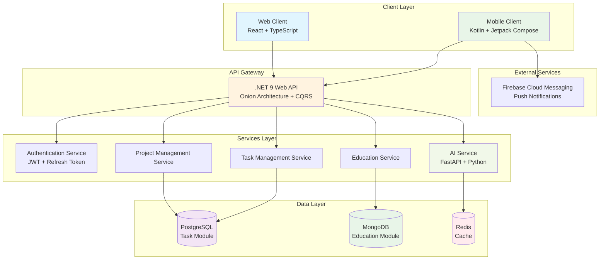
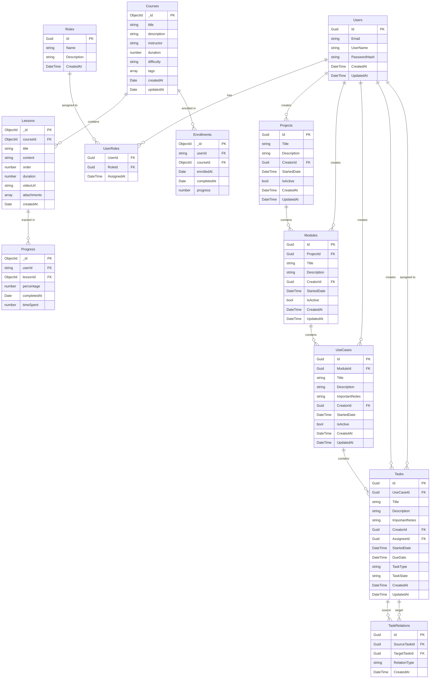
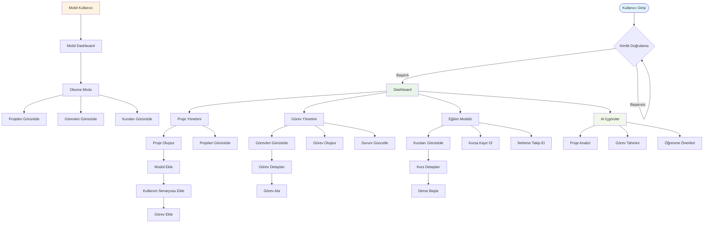
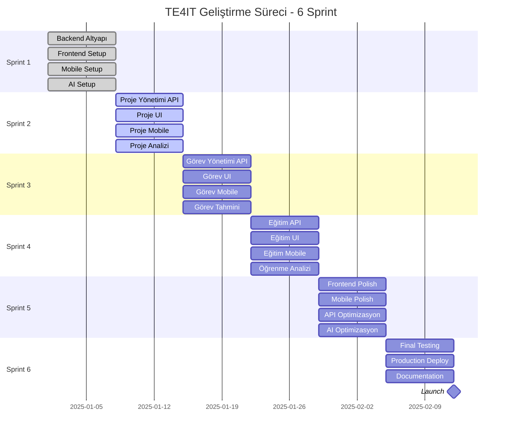
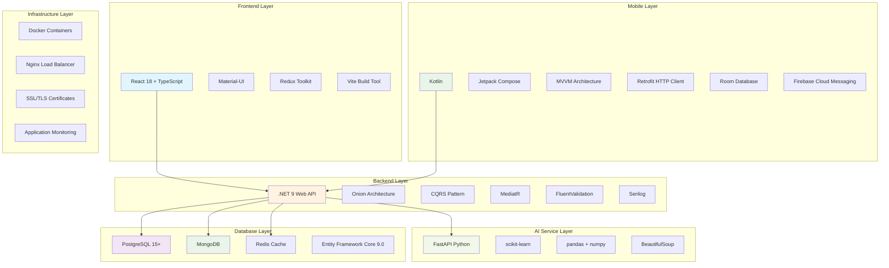
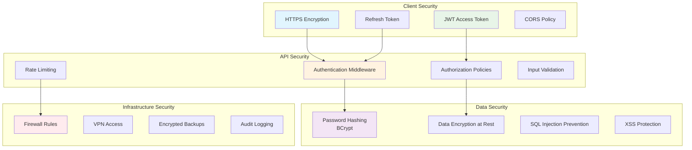

# TE4IT - Sistem Diyagramları

## 1. Sistem Mimarisi Diyagramı



## 2. Veritabanı ER Diyagramı



## 3. Kullanıcı Akış Diyagramı



## 4. API Endpoint Diyagramı

```mermaid
graph TB
    subgraph "Authentication Endpoints"
        AUTH_REG[POST /auth/register]
        AUTH_LOGIN[POST /auth/login]
        AUTH_REFRESH[POST /auth/refresh]
        AUTH_LOGOUT[POST /auth/logout]
    end
    
    subgraph "Project Management Endpoints"
        PROJ_GET[GET /projects]
        PROJ_POST[POST /projects]
        PROJ_PUT[PUT /projects/{id}]
        PROJ_DELETE[DELETE /projects/{id}]
        MODULE_GET[GET /projects/{id}/modules]
        MODULE_POST[POST /projects/{id}/modules]
        USECASE_GET[GET /modules/{id}/usecases]
        USECASE_POST[POST /modules/{id}/usecases]
    end
    
    subgraph "Task Management Endpoints"
        TASK_GET[GET /tasks]
        TASK_POST[POST /tasks]
        TASK_PUT[PUT /tasks/{id}]
        TASK_DELETE[DELETE /tasks/{id}]
        TASK_ASSIGN[POST /tasks/{id}/assign]
        TASK_STATUS[PUT /tasks/{id}/status]
        TASK_RELATION[POST /tasks/{id}/relations]
    end
    
    subgraph "Education Endpoints"
        COURSE_GET[GET /courses]
        COURSE_POST[POST /courses]
        COURSE_DETAIL[GET /courses/{id}]
        LESSON_GET[GET /courses/{id}/lessons]
        ENROLL_POST[POST /courses/{id}/enroll]
        PROGRESS_GET[GET /progress]
        PROGRESS_POST[POST /progress]
    end
    
    subgraph "AI Service Endpoints"
        AI_PROJECT[POST /ai/project-analysis]
        AI_TASK[POST /ai/task-prediction]
        AI_RECOMMEND[GET /ai/recommendations]
    end
    
    subgraph "Response Types"
        SUCCESS[200 OK]
        CREATED[201 Created]
        BAD_REQUEST[400 Bad Request]
        UNAUTHORIZED[401 Unauthorized]
        NOT_FOUND[404 Not Found]
        SERVER_ERROR[500 Internal Server Error]
    end
    
    AUTH_REG --> CREATED
    AUTH_LOGIN --> SUCCESS
    PROJ_GET --> SUCCESS
    PROJ_POST --> CREATED
    TASK_GET --> SUCCESS
    TASK_POST --> CREATED
    COURSE_GET --> SUCCESS
    
    style AUTH_REG fill:#e1f5fe
    style PROJ_POST fill:#e8f5e8
    style TASK_POST fill:#fff3e0
    style COURSE_GET fill:#f3e5f5
    style AI_PROJECT fill:#f1f8e9
```

## 5. Sprint Timeline Diyagramı



## 6. Teknoloji Stack Diyagramı



## 7. Güvenlik Mimarisi Diyagramı


