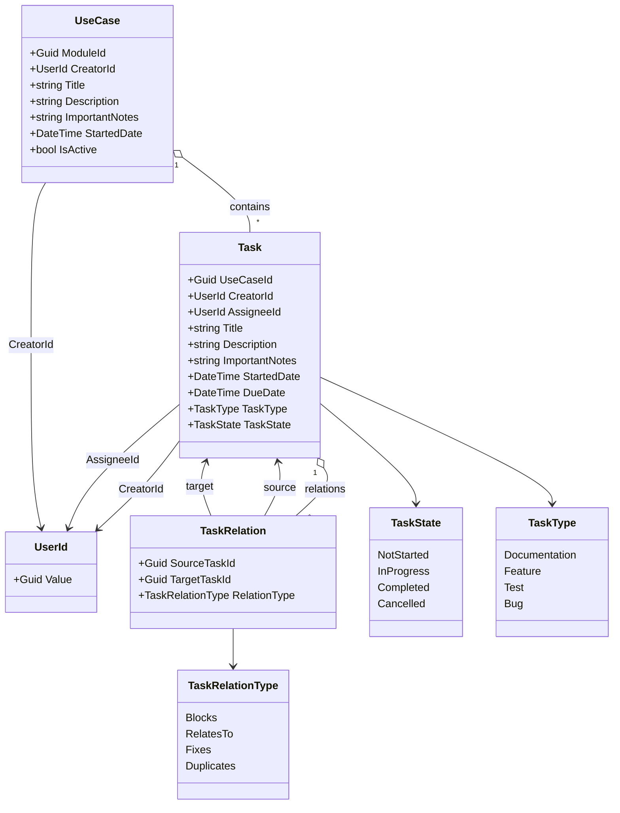

Task Management — Class Diagram (Mermaid)

Aşağıdaki diyagram yalnızca Görev Yönetimi alanını (Task, TaskRelation, UseCase ve ilgili enumlar/VO) kapsamaktadır.

Notlar
- `Task` durum geçişleri: NotStarted → InProgress → Completed; InProgress → Cancelled; Completed için geri alma `Revert()` ile kontrol edilir.
- `TaskRelation` ile döngüsel bağımlılık uygulama seviyesinde engellenmelidir.

